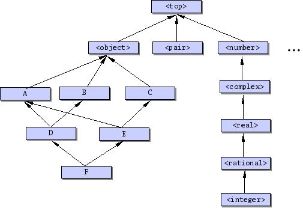

//  SPDX-License-Identifier: GFDL-1.3-or-later
//
//  Copyright © 2000-2023 Erick Gallesio <eg@stklos.net>
//
//           Author: Erick Gallesio [eg@unice.fr]
//    Creation date: 26-Nov-2000 18:19 (eg)

{{chapter "STklos Object System"}}

=== Introduction
The aim of this chapter is to present {{stklos}} object
system.  Briefly stated, {{stklos}} gives the  programmer
an extensive object system with meta-classes, multiple
inheritance, generic functions and multi-methods.  Furthermore,
its implementation relies on a MOP  (Meta Object Protocol
(MOP) <<AMOP>>),
in the spirit of the one defined for
CLOS <<CLtL2>>.

{{stklos}} implementation is derived from the version 1.3 of *_Tiny CLOS_*, a
pure and clean CLOS-like MOP implementation in Scheme written by Gregor
Kickzales <<Tiny-Clos>>. However, Tiny CLOS implementation was designed as a
pedagogical tool and consequently, completeness and efficiency were not the
author concern for it.  {{stklos}} extends the Tiny CLOS model to be efficient
and as close as possible to CLOS, the Common Lisp Object System <<CLtL2>>.
Some features of {{stklos}} are also issued from <<Dylan>> or <<SOS>>.


This chapter is divided in three parts, which have a quite different audience
in mind:


*  The first part presents the {{stklos}} object system rather
informally; it is intended to be a tutorial of the language and is
for people who want to have an idea of the *_look and feel_* of
{{stklos}}.
* The second part describes the {{stklos}} object system at
  the *_external_* level (i.e.  without requiring the use of the
  Meta Object Protocol).
* The third and last part describes the {{stklos}} Meta
  Object Protocol.  It is intended for people whio want to play with
  meta programming.


=== Object System Tutorial

The {{stklos}} object system relies on classes like most of the current OO
languages.  Furthermore, {{stklos}} provides meta-classes, multiple
inheritance, generic functions and multi-methods as in CLOS, the Common Lisp
Object System <<CLtL2>> or <<Dylan>>.  This chapter presents {{stklos}} in
a rather informal manner.  Its intent is to give the reader an idea of the
"*_look and feel_*" of {{stklos}} programming.  However, we suppose here that
the reader has some basic notions of OO programming, and is familiar with
terms such as *_classes, instances_* or *_methods._*


==== Class definition and instantiation

===== Class definition
(((class)))
(((class, definition")))
((("define-class")))
A new class is defined with the `define-class` form.
The syntax of `define-class` is close to CLOS `defclass`:


```scheme
(define-class class (superclass~1~ superclass~2~ ...)
  (slot-description1
   slot-description2
   ...)
  metaclass option)
```

The *_metaclass option_* will not be discussed here.
The **_superclass_**es list specifies the super classes of
*_class_* (see <<_inheritance>> for details).

((("class")))
A *_slot description_* gives the name of a slot and,
eventually, some _properties_ of this slot (such as its
initial value, the function which permit to access its value,
...). Slot descriptions will be discussed in
,(index "slot-definition").

As an example, consider now that we want to define a point as an object. This
can be done with the following class definition:


```scheme
(define-class <point> ()
  (x y))
```

This definition binds the symbol `<point>` to a new class whose instances
contain two slots. These slots are called `x` an `y` and we suppose here that
they contain the coordinates of a 2D point.

Let us define now a circle, as a 2D point and a radius:


```scheme
(define-class <circle> (<point>)
  (radius))
```

As we can see here, the class `<circle>` is constructed by inheriting from the
class `<point>` and adding a new slot (the `radius` slot).


===== Instance creation and slot access
((("instance")))
((("make")))
Creation of an instance of a previously defined class can
be done with the `make` procedure. This procedure takes
one mandatory parameter which is the class of the instance which
must be created and a list of optional arguments. Optional
arguments are generally used to initialize some slots of the
newly created instance. For instance, the following form:


```scheme
(define  c (make <circle>))
```

creates a new `<circle>` object and binds it to the `c` Scheme variable.

((("slot-ref")))
((("slot-set!")))
((("slot")))
Accessing the slots of the newly created circle can be done
with the `slot-ref` and the `slot-set!` primitives. The `slot-set!`
primitive permits to set the value of an object slot and `slot-ref`
permits to get its value.


```scheme
(slot-set! c 'x 10)
(slot-set! c 'y 3)
(slot-ref c 'x)       =>  10
(slot-ref c 'y)       =>  3
```

Using the `describe` function is a simple way to see all the slots of an
object at one time: this function prints all the slots of an object on the
standard output. For instance, the expression:


```scheme
(describe c)
```

prints the following information on the standard output:

```
#[<circle> 81aa1f8] is an an instance of class <circle>.
Slots are:
     radius = #[unbound]
     x = 10
     y = 3
```

===== Slot Definition
When specifying a slot, a set of options can be given to
the system.  Each option is specified with a keyword. For
instance,

* ((("slot", initialization))) *:init-form* can be used to supply a default value for the slot.

* *:init-keyword* can be used to specify the keyword used for initializing a slot.

* ((("slot", getter))) *:getter* can be used to define the name of the slot getter

* ((("slot", setter))) *:setter* can be used to define the name of the slot setter

* ((("slot", accessor))) *:accessor* can be used to define the name of the slot accessor
  (see below)

To illustrate slot description, we redefine here the `<point>` class seen
before. A new definition of this class could be:

```scheme
(define-class <point> ()
  ((x :init-form 0 :getter get-x :setter set-x! :init-keyword :x)
   (y :init-form 0 :getter get-y :setter set-y! :init-keyword :y)))
```


With this definition,

1. the `x` and `y` slots are set to 0 by default.

2. The value of a slot can also be specified by calling `make` with the `:x` and `:y`
   keywords.

3. Furthermore, the generic functions `get-x` and `set-x!` (resp.  `get-y` and
   `set-y!`) are automatically defined by the system to read and write the `x`
   (resp.  `y`) slot.


```scheme
(define p1 (make <point> :x 1 :y 2))
(get-x p1)        => 1
(set-x! p1  12)
(get-x p1)        => 12

(define  p2 (make <point> :x 2))
(get-x p2)         => 2
(get-y p2)         => 0
```

((("set!")))
Accessors provide an uniform access for reading and writing an object slot.
Writing a slot is done with an extended form of `set!`  which is
close to the Common Lisp `setf` macro.  A slot accessor can be
defined with the `:accessor` option in the slot
description.  Hereafter, is another definition of our
`<point>` class, using an accessor:


```scheme
(define-class <point> ()
  ((x :init-form 0 :accessor x-of :init-keyword :x)
   (y :init-form 0 :accessor y-of :init-keyword :y)))
```

Using this class definition, reading the x coordinate of the `p` point can be
done with:

```scheme
(x-of p)
```

and setting it to 100 can be done using the extended `set!`

```scheme
(set! (x-of p) 100)
```

[NOTE]
====
{{stklos}} also define `slot-set!` as the <<setter,setter function>> of `slot-ref`.
As a consequence, we have

```scheme
(set! (slot-ref p 'y) 100)
(slot-ref p 'y)       => 100
```
====


===== Virtual Slots
((("slot")))
((("virtual slot")))
Suppose that we need slot named `area` in circle objects which contain the
area of the circle. One way to do this would be to add the new slot to the
class definition and have an initialisation form for this slot which takes
into account the radius of the circle. The problem with this approach is that
if the `radius` slot is changed, we need to change `area` (and
vice-versa). This is something which is hard to manage and if we don't care,
it is easy to have a `area` and `radius` in an instance which are
"un-synchronized".  The virtual slot mechanism avoid this problem.

A virtual slot is a special slot whose value is calculated rather than stored
in an object.  The way to read and write such a slot must be given when the
slot is defined with the `:slot-ref` and `:slot-set!` slot options.

A complete definition of the `<circle>` class
using virtual slots could be:

```scheme
(define-class <circle> (<point>)
  ((radius :init-form 0 :accessor radius :init-keyword :radius)
   (area :allocation :virtual :accessor area
	     :slot-ref (lambda (o) (let ((r (radius o))) (* 3.14 r r)))
	     :slot-set! (lambda (o v) (set! (radius o) (sqrt (/ v 3.14)))))))
```

Here is an example using this definition of `<circle>`


```scheme
(define c (make <circle> :radius 1))
(radius c)                           => 1
(area c)                             => 3.14
(set! (area x) (* 4 (area x)))
(area c)                             => 12.56   ;; (i.e. ⒋π)
(radius c)                           => 2.0
```


Of course, we can also used the function `describe` to visualize
the slots of a given object. Applied to the prvious `c`, it prints:

```
#[<circle> 81b2348] is an an instance of class <circle>.
Slots are:
     area = 12.56
     radius = 2.0
     x = 0
     y = 0
```

==== Inheritance

===== Class hierarchy and inheritance of slots
((inheritance))
Inheritance is specified upon class definition. As said in the introduction,
{{stklos}} supports multiple inheritance.  Hereafter are some classes
definition:

```scheme
(define-class A () (a))
(define-class B () (b))
(define-class C () (c))
(define-class D (A B) (d a))
(define-class E (A C) (e c))
(define-class F (D E) (f))
```

Here,

* `A`, `B`, `C` have a null list of super classes. In this case, the
system will replace it by the list which only contains `<object>`, the root of
all the classes defined by `define-class`.
* `D`, `E`, and `F` use multiple inheritance: each class inherits from two
previously defined classes.  Those class definitions define a hierarchy which
is shown in <<class_hierarchy>>.

[#class_hierarchy]
.A class hiearchy



In this figure, the class `<top>` is also shown; this class is the super class
of all Scheme objects. In particular, `<top>` is the super class of all
standard Scheme types.

The set of slots of a given class is calculated by "unioning" the slots of all
its super class. For instance, each instance of the class `D` defined before
will have three slots (`a`, `b` and `d`). The slots of a class can be obtained
by the `class-slots` primitive.  For instance,


```scheme
(class-slots A) => (a)
(class-slots E) => (a e c)
(class-slots F) => (b e c d a f)
```

NOTE: The order of slots is not significant.


===== Class precedence list
((("class precedence list")))

A class may have more than one superclass footnote:[ This section is an
adaptation of Jeff Dalton's (J.Dalton@ed.ac.uk) "*_Brief introduction to
CLOS_*" which can be found at http://www.aiai.ed.ac.uk/~jeff/clos-guide.html].

With single inheritance (only one superclass), it is easy to order the super
classes from most to least specific.  This is the rule:


****
*Rule 1: Each class is more specific than its superclasses.*
****


With multiple inheritance, ordering is harder.  Suppose we have


```scheme
(define-class X ()
   ((x :init-form 1)))

(define-class Y ()
   ((x :init-form 2)))

(define-class Z (X Y)
   (z :init-form 3))
```

In this case, given **Rule 1**, the `Z` class is more specific than the `X` or `Y`
class for instances of `Z`.  However, the `:init-form` specified in `X` and
`Y` leads to a problem: which one overrides the other?  Or, stated
differently, which is the default initial value of the `x` slot of a `Z`
instance.  The rule in {{stklos}}, as in CLOS, is that the superclasses listed
earlier are more specific than those listed later.  So:


****
*Rule 2: For a given class, superclasses listed earlier are more specific than those listed later.*
****

These rules are used to compute a linear order for a class and all its
superclasses, from most specific to least specific.  This order is called the
"*_class precedence list_*" of the class.  Given these two rules, we can claim
that the initial form for the `x` slot of previous example is 1 since the
class `X` is placed before `Y` in the super classes of `Z`.  These two rules
are not always sufficient to determine a unique order.  However, they give an
idea of how the things work. {{stklos}} algorithm for calculating the class
precedence list of a class is a little simpler than the CLOS one described in
<<AMOP>> for breaking ties.  Consequently, the calculated class
precedence list by {{stklos}} algorithm can be different than the one given by
the CLOS one in some subtle situations.  Taking the `F` class shown in <<class_hierarchy>>,
the {{stklos}} calculated class precedence list is


```scheme
(F D E A B C <object> <top>)
```
whereas it would be the following list with a CLOS-like algorithm:

```scheme
(F D E A C B <object> <top>)
```

((("class-precedence-list"))) However, it is usually considered a bad idea for
programmers to rely on exactly what the order is.  If the order for some
superclasses is important, it can be expressed directly in the class
definition.  The precedence list of a class can be obtained by the function
`class-precedence-list`.  This function returns a ordered list whose first
element is the most specific class.  For instance,


```scheme
(class-precedence-list D)
    => (#[<class> D 81aebb8] #[<class> A 81aab88]
        #[<class> B 81aa720] #[<class> <object> 80eff90]
        #[<class> <top> 80effa8])
```

((("class-name"))) However, this result is hard to read; using the function
`class-name` yields a clearer result:


```scheme
(map class-name (class-precedence-list D))
  => (D A B <object> <top>)
```


==== Generic functions
===== Generic functions and methods
((("generic function")))
((("method")))
((("method", more specific)))
Neither {{stklos}} nor CLOS use the message passing mechanism
for methods as most Object Oriented languages do.  Instead, they
use the notion of *_generic function_*.A generic function
can be seen as a "*_tanker_*" of methods.  When the
evaluator requests the application of a generic function, all the
applicable methods of this generic function will be grabbed and
the most specific among them will be applied.  We say that a
method `M` is *_more specific_* than a method `M'`
if the class of its parameters are more specific than the `M'`
ones.  To be more precise, when a generic function must be
"*_called_*" the system


- searchs among all the generic function methods those which
are applicable (i.e.  the ones which filter on types which are
*_compatible_* with the actual argument list),
- sorts the list of applicable methods in the "*_most specific_*"
order,
- calls the most specific method of this list (i.e.  the
first of the list of sorted methods).

((("define-generic")))
((("define-method")))
The definition of a generic function is done with the
`define-generic` macro. Definition of a new method is
done with the `define-method` macro.

Consider the following definitions:


```scheme
(define-generic M)
(define-method M((a <integer>) b) 'integer)
(define-method M((a <real>)    b) 'real)
(define-method M(a b)             'top)
```


The `define-generic` call defines `M` as a
generic function.  Note that the signature of the generic
function is not given upon definition, contrarily to CLOS.  This
permits methods with different signatures for a given generic
function, as we shall see later.  The three next lines define
methods for the `M` generic function.  Each method uses a
sequence of *_parameter specializers_* that specify when
the given method is applicable.  A specializer permits to
indicate the class a parameter must belong (directly or
indirectly) to be applicable.  If no specializer is given, the
system defaults it to `<top>`>.  Thus, the first method
definition is equivalent to


```scheme
(define-method M((a <integer>) (b <top>)) 'integer)
```

Now, let us look at some possible calls to generic
function `M`:


```scheme
(M 2 3)      => integer
(M 2 #t)     => integer
(M 1.2 'a)   => real
(M #t #f)    => top
(M 1 2 3)    => error (no method with 3 parameters)
```

The preceding methods use only one specializer per parameter
list. Of course, each parameter can use a specializer.  In this
case, the parameter list is scanned from left to right to
determine the applicability of a method.  Suppose we declare now


```scheme
(define-method M ((a <integer>) (b <number>))
    'integer-number)

(define-method M ((a <integer>) (b <real>))
    'integer-real)

(define-method M (a (b <number>))
    'top-number)

(define-method M (a b c)
    'three-parameters)
```

In this case, we have

```scheme
(M 1 2)     => integer-integer
(M 1 1.0)   => integer-real
(M 'a 1)    => top-number
(M 1 2 3)   => three-parameters
```
[NOTE]
====
- Before defining a new generic function `define-generic,` verifies if
the symbol given as parameter is already bound to a procedure in the
current environment.  If so, this procedure is added, as a method to
the newly created generic function.  For instance:
+
```scheme

(define-generic log)  ; transform "log" in a generic function

(define-method log ((s <string>) . l)
   (apply format  (current-error-port) s l)
   (newline (current-error-port)))

(log "Hello, ~a" "world")      |- Hello, world
(log 1)                        => 0 ; standard "log" procedure
```

- `define-method` automatically defines the
generic function if it has not been defined before.
Consequently, most of the time, the `define-generic` is
not needed.
====


===== Next-method
((("method", next)))
((("next-method")))
When a generic function is called, the list of applicable
methods is built.  As mentioned before, the most specific method
of this list is applied (see <<_generic_function>>).

This method may call, if needed, the next method in the list of
applicable methods.  This is done by using the special form
`next-method`.  Consider the following definitions

```scheme
(define-method Test((a <integer>))
   (cons 'integer (next-method)))

(define-method Test((a <number>))
   (cons 'number  (next-method)))

(define-method Test(a)
   (list 'top))
```

With those definitions, we have:


```scheme
(Test 1)     => (integer number top)
(Test 1.0)   => (number top)
(Test #t)    => (top)
```

===== Standard  generic functions
((("write")))
((("display")))
*Printing objects*

When the Scheme primitives `write` or `display` are called with a
parameter which is an object, the `write-object` or `display-object`
generic functions are called with this object and the port to which
the printing must be done as parameters.  This facility permits to
define a customized printing for a class of objects by simply defining
a new method for this class.  So, defining a new printing method
overloads the standard printing method (which just prints the class of
the object and its hexadecimal address).

For instance, we can define a customized printing for the `<point>`
used before as:


```scheme
(define-method display-object ((p <point>) port)
  (format port "<Point x=~S y=~S>" (slot-ref p 'x) (slot-ref p 'y)))
```
With this definition, we have


```scheme
(define p (make <point> :x 1 :y 2))
(display p)                         |= <Point x=1 y=2>
```

The Scheme primitive `write` tries to write objects, in such a way
that they are readable back with the `read` primitive.  Consequently,
we can define the writing of a `<point>` as a form which, when read,
will build back this point:


```scheme
(define-method write-object ((p <point>) port)
 (format port "#,(make <point> :x ~S :y ~S)"
              (get-x p) (get-y p)))
```
With this method, writing the `p` point defined before
prints the following text on the output port:


```scheme
#,(make <point> :x 1 :y 2)
```
Note here the usage of the `#,`  notation of {{link-srfi 10}} used here
to "evaluate" the form when reading it. We suppose here that we are in a context
where we already defined:

```scheme
(define-reader-ctor 'make (lambda l (eval `(make ,@l))))
```


*Comparing objects* +
(((object-eqv?)))
(((object-equal?)))
When objects are compared with the `eqv?` or `equal?` Scheme standard
primitives, {{stklos}} calls the `object-eqv?` or `object-equal?`
generic functions.  This facility permits to define a customized
comparison function for a class of objects by simply defining a new
method for this class.  Defining a new comparison method overloads the
standard comparaison method (which always returns `#f`).  For instance
we could define the following method to compare points:


```scheme
(define-method object-eqv? ((a <point>) (b <point>))
  (and (= (point-x a) (point-x b))
       (= (point-y a) (point-y b))))
```

=== Object System Main Functions and Syntaxes

==== Classes and Instances

{{insertdoc 'define-class}}
{{insertdoc 'make-instance}}
{{insertdoc 'class-name}}
{{insertdoc 'class-of}}
{{insertdoc 'class-name}}
{{insertdoc 'find-class}}
{{insertdoc 'is-a?}}
{{insertdoc 'ensure-metaclass}}

==== Generic Functions and Methods

Generic functions and methods are an important part of {{stklos}} object
system. A generic function is a function which can have several methods with a
behavior which depends of the type or the number of its parameters.

{{insertdoc 'define-generic}}
{{insertdoc 'define-method}}
{{insertdoc 'next-method}}

==== Misc.

{{insertdoc  'class-precedence-list}}
{{insertdoc  'class-direct-slots}}
{{insertdoc  'class-slot-definition}}
{{insertdoc  'slot-definition-init-keyword}}
