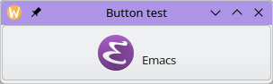
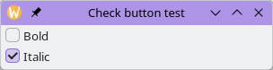
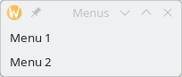
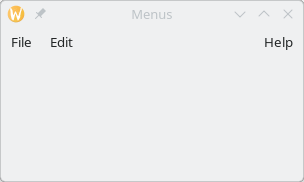

//  SPDX-License-Identifier: GFDL-1.3-or-later
//
//  Copyright © 2000-2024 Erick Gallesio <eg@stklos.net>
//
//           Author: Erick Gallesio [eg@stklos.net]
//    Creation date:  31-Oct-2024 09:48

== Button widgets

{{class-doc "button"}}
=== Class <button>

A `<button>` widget is generally used to trigger a callback function
that is called when the button is pressed.

{{show-class-table <button>}}

Slots::
- *command* denotes the callback called when the button is clicked
   (see <<command_slot, command _slot_>>).
- *image* contains the child widget to appear next to the button text.
- *image-position* is a symbol used to define the position of the
   image relative to the text inside the button. It's value can be one
   of the symbols `left`, `right`, `top`, `bottom`.
- *relief* is a symbol describing the relief style of the button. Its
   value can be the `normal` or `none`.
- *text* is a string which contains the button label.
- *use-underline* if true, an underline in the text of the button
  label indicates the next character should be used for the mnemonic
  accelerator key.
- *xalign* is a float that can be used to control the horizontal
   position of button content (0.0 is left and 1.0 is right). The
   default value is 0.5.
- *yalign* is a float that can be used to control the vertical
   position of button content (0.0 is top and 1.0 is bottom). The
   default value is 0.5.

Method::

- *realize-widget* {{see-realize}}.

Here is a simple button with a text and an image. Clicking on the button, will
launch the _emacs_ editor:

<<<
[source, scheme]
----
(let ((w (make <vwindow> :title "Button test" :width 300 :height 40)))
  ;; create a button with a text and an image
  (make <button> :text " Emacs "
        :image (make <image> :icon-name "emacs")
        :parent w
        :command (lambda (e w) (system "emacs &"))))
----

This code displays a window with a the _emacs_ button:

// ----------------------------------------------------------------------
{{class-doc "check-button"}}
=== Class <check-button>

A `<check-button>` is a button with a toggle button displayed next to the
button label.

{{show-class-table <check-button>}}

Slot::

- *value* is a boolean. It indicates if the check button is on or off.

Method::

- *realize-widget** {{see-realize}}.

[source,scheme]
----
(let ((w (make <vwindow> :title "Check button test" :width 300 :height 40)))
  (make <check-button> :text "Bold"   :parent w)
  (make <check-button> :text "Italic" :parent w :value #t))
----

This code displays the following window:

// ----------------------------------------------------------------------
{{class-doc "radio-button"}}
=== Class <radio-button>

A `<radiobutton>` is similar to a check button. Radio buttons are generally
pcas in a group of radio buttons.  When one is selected, all other radio
buttons in the same group are deselected. It is one way of giving the user a
choice from many options.

{{show-class-table <radio-button>}}

Slots::

- *radio-selected* contains the radio button which is selected in the
   radio-button's group. For-instance the expression `(text (radio-selected
   b))` can be used to find the label string of the radio group to which the
   button `b` belongs. Note any button of the group can be used here to find
   the selected radio button.
- *sibling* is a read-only slot. It contains the value of the `#:sibling`
   option passed when the widget was initialized. See `initialize-instance`
   below.

[#initialize-instance]
Methods::

- *initialize-instance* for radio buttons takes care of the `#:sibling` option
   which can be passed during their creation. If no sibling is passed (or is
   `#f`), the radio button creates a new group and register it in this
   group. If a sibling is passed, it must be a radio button and the new
   created button will be registered in the same group of this sibling radio
   button.
- *radio-group* returns a list of all the buttons of the group to which
   belongs the radio button passed as parameter.
- *realize-widget* {{see-realize}}.

[source,scheme]
----
(let* ((w  (make <vwindow> :title "Radio button test" :width 300 :height 40))
       (b1 (make <radio-button> :text "Small"  :parent w))
       (b2 (make <radio-button> :text "Normal" :parent w :sibling b1))
       (b3 (make <radio-button> :text "Big"    :parent w :sibling b1)))
    (set! (radio-selected b1) b2)) ;; Select button b2 instead of the group leader b1
----

The evaluation of this code will display the following window.

image::images/radio-figure.png[images/radio-figure,align="center"]

// ______________________________________________________________________

{{class-doc "combobox"}}
=== Class <combobox>

A `<combobox>` permits the user to choose from a list of valid choices. It
displays the selected choice. When activated, the combo box displays a popup
with a list of valid choices.

{{show-class-table <combobox>}}

Slots::

- *command* contains the callback function that will be used when  an entry is selected.
- *items* is a list of strings. It represents the correct values for the combo box.
- *value* is the current selected value of in the combo box. If no value is
  selected, this slot is `#f`.

Methods::

- *container-add!* permits to append a value to the end of the list of items.
  If the value given is not a string, it is converted before to a string.
- *realize-widget* {{see-realize}}.

Example::

[source,scheme]
----
(let ((w  (make <vwindow> :title "Combo box test" :width 300 :height 40)))
  (make <combobox> :parent w  :items '("XS" "S" "M" "L" "XL")
        :value "M"
        :command (lambda (w e)
                   (printf "You have selected ~S\n" (value w)))))
----

// ----------------------------------------------------------------------
{{class-doc "entry-combobox"}}
=== Class <entry-combobox>

An `<entry-combobox>` is similar to a `<combo-box>`, excepts that its value
can be edited.

{{show-class-table <entry-combobox>}}

Slots::

- *has-frame* is a boolean. It indicates whether a frame is drawn around the entry.
- *value* is the current selected value of in the combo box. If no value is
  selected, this slot is `#f`.

Method::

- *realize-widget* {{see-realize}}.

// ----------------------------------------------------------------------
=== Menus

A GTKlos drop down menu is a special kind of button composed of menu items (of
class `<menu-item>`). The menu buttons are generally arranged in a menu bar
(of class `menu-bar>`).

// --------------------
{{class-doc "menu-bar"}}
==== Class <menu-bar>

A `<menu-bar>` is a container whose children are menu items. It permits to
implement a menu bar with several sub-menus.

NOTE: Building a menu bar and its components generally takes a lot of lines of
code. Using the `add-items-to-menubar` method can be used to simplify this
task (see below).

{{show-class-table <menu-bar>}}

Slots::

- *child-pack-direction* is a symbol which describes how the children menu
   items composing the menu in the bar are added. It's value is one of the
   symbols 'left->right' (the default), `right->left`, `top->bottom` or
   `bottom->top`.
- *pack-direction* is a symbol which describes how the menu items composing
   the menu in the bar are added. It's value is one of the symbols
   'left->right' (the default), `right->left`, `top->bottom` or `bottom->top`.

Methods::

- *add-items-to-menubar* permit to create a menu bar and fill its components
   in a declarative way. A description of this method is given in <<_method_add_items_to_menubar>>
- *realize-widget* {{see-realize}}

In the following example, we create a menu bar with two menu items arranged
vertically, thanks to the `pack-direction` slot which is set to `top->bottom`

[source,scheme]
----
(let* ((win (make <vwindow>  :title "Menus" :height 20))
       (mb  (make <menu-bar>  :parent win :pack-direction 'top->bottom)))
  (make <menu-item> :text "Menu 1" :parent mb)
  (make <menu-item> :text "Menu 2" :parent mb))
----

The menu bar:

// --------------------
{{class-doc "menu"}}
==== Class <menu>

A `<menu>` implements a drop down menu consisting of a list of *menu items*.
A *<menu>* is most commonly dropped down by activating a menu item in a *<menu-bar>*

{{show-class-table <menu>}}

Slots::

- *active* contains the index of the currently selected menu item,
  or -1 if no menu item is selected.
- *reserve-toggle-size* is a  boolean that indicates whether the menu reserves
  space for toggles and icons, (even if not present).

Methods::

- *container-add!* see the description of this method in <<_class_menu_item>>
- *realize-widget* {{see-realize}}.

// --------------------
{{class-doc "menu-item"}}
==== Class <menu-item>

A `<menu-item>` (or a derived class) is the only possible class of the
components of a *<menu>*.

{{show-class-table <menu-item>}}

Slots::

- *right-justified* is boolean which indicates whether the menu item appears
   justified at the right side of a menu bar.
- *text* contains the text displayed in the menu item.
- *use-underline* indicates if an underline character the menu item's text
   consists in a accelerator key.

Methods::

- *container-add!* permits to add a sub-menu (second parameter) to a menu item
   (first parameter. Other arguments are ignored.
- *realize-widget* {{see-realize}}.

// --------------------
{{class-doc "menu-check-item"}}
==== Class <menu-check-item>

A `<menu-check-item>` is a menu item that maintains the state of a boolean
value in addition to a *<menu-item>* usual role in activating application code.

A check box is displayed at the left side of the menu item to indicate the
boolean state. Activating the menu item toggles the boolean value.

{{show-class-table <menu-check-item>}}

Slots::

- *draw-as-radio* is a boolean. It indicates if the check box is drawn as a
   `<menu-radio-item>  .
- *inconsistent* is a boolean. It graphically indicates that the check button
   is in an inconsistent state (check button is not empty and not
   checked). This can be useful if clicking this value is not coherent with the
   current state of the application.
- *value* is a boolean. It indicates if the box is checked or not.

Methods::

- *realize-widget* {{see-realize}}.

// --------------------
{{class-doc "menu-radio-item"}}

==== Class <menu-radio-item>

A `<menu-radio-item>` is a check menu item that belongs to a group. At each
instant exactly one of the radio menu items from a group is selected.

{{show-class-table <menu-radio-item>}}

Slot::

- *sibling*

Methods::

- *initialize-widget* accepts a list of keyword arguments. You can use the
   `#sibling` argument to set join the newly created radio button to an
   already created menu radio item.
- *realize-widget* {{see-realize}}.

Example::

[source,scheme]
----
(let* ((win (make <vwindow>  :title "Menus" :width 300 :height 150))
       (mb  (make <menu-bar>  :parent win))
       (mi  (make <menu-item> :text "A menu" :parent mb))
       ;; Add a menu to mi menu item
       (m   (make <menu> :parent mi))
       ;; Add 3 menu-radio-items to m (in the same group (group leader is c1)
       (c1  (make  <menu-radio-item> :text "Check 1" :parent m :value #t))
       (c2  (make  <menu-radio-item> :text "Check 2" :parent m :sibling c1))
       (c3  (make  <menu-radio-item> :text "Check 3" :parent m :sibling c1)))
  'done)
----

Here, we create a menu bar `mb` with only one menu item `mi`. This menu item
contains a sub-menu `m`. In `m`, we have added 3 radio buttons in the same
group (they all belong to the group of `c1`). Note that `c1` is clicked since
its value is `#t`.

// --------------------
{{class-doc "menu-separator-item"}}
==== Class <menu-separator-item>

The `<menu-separator-item>` is a separator used to group items within a
menu. It displays a horizontal line in the interface.

{{show-class-table <menu-separator-item>}}

Method::

- *realize-widget* {{see-realize}}.

// --------------------
==== Method add-items-to-menubar

As you have probably seen in previous examples, building a menu bar an all its
sub-menus is quite complex, and easily error prone. The helper method
`add-items-to-menubar` permits to have a mod declarative approach. This method
takes two parameters: a menu bar and a list specifying the components to embed
in this menu bar.

The specification list components are all Scheme lists specifying a child menu
item of the menu bar. By convention, an empty list indicates that the next
menu items are placed on the right of the menu bar.

A child menu item is described also by a list whose, first item is the text
displayed in its sub menu.

As a first example, we can construct a simple interface:

[source,scheme]
----
(let* ((win (make <vwindow>  :title "Menus" :width 300 :height 150))
       (mb  (make <menu-bar>  :parent win)))
  (add-items-to-menubar mb
                        `(("File")
                          ("Edit")
                          ()
                          ("Help"))))
----

It will produce the following window on screen:

We can now populate each menu item of this menu bar. by specifying their
components in each sub-list. For instance, to add several sub-menus in the
previous "File" menu item, we can replace `("File")` by the following list:

[source,scheme]
----
 ("File"
     ("Load")
     ("Save")
     ("") ;; <== We want a separator here
     ("Quit"))
----

For each menu item of this sub menu, we can specify which kind of menu item we
have with the `:type` key. This key accepts the following values: `:item` (the
default), `:check`, `:radio`, `:separator`, `:cascade` (for a cascading
menu). Each kind of menu item accepts the `:command` key to specify the
callback that mus be run when the menu item is clicked. For radio buttons, the
boolean key `:first` can be used to specify that this menu item is the fist
one of a new group of radio button.

For the previous example, we could have:

[source,scheme]
----
 ("File"
     ("Load" :command ,do-load )   ; do-load is a callback function
     ("Save" :command ,do-save )   ; do-save too
     ("" :type :separator )
     ("Quit" :command ,(lambda ignore (exit 0))))
----

For cascading menu, the sub menu mus be given with the `:menu` key. For
instance, we could replace the previous example with

[source,scheme]
----
("File"
    ("Load"   :command ,do-load )   ; do-load is a callback function
    ("Save"   :command ,do-save )   ; do-save too
    ("Export" :type :cascade
              :menu (("PDF" :command ,export-pdf)   ; a callback
                     ("PNG" :command ,export-png))) ; another one
    (""       :type :separator )
    ("Quit"   :command ,(lambda ignore (exit 0))))
----

<<<
To conclude, hereafter is an example using all the possible menu items:

[source,scheme]
----
(define (action w e)
  (eprintf "You have clicked ~S\n" (text w)))

(let* ((win (make <vwindow>  :title "Menus" :width 300 :height 150))
       (mb  (make <menu-bar>  :parent win)))

  (add-items-to-menubar
        mb
        `(("File"
           ("Load"   :command ,action)
           ("Save"   :command ,action)
           (""       :type    :separator)
           ("Quit"   :command ,(lambda _ (exit 0))))
          ("Edit"
           ("Copy"   :command ,action)
           ("Cut"    :command ,action)
           ("Paste"  :command ,action))
          ("Cascade"
           ("  1  " :type :cascade
            :menu (("One"  :command ,action)
                   ("Un"   :command ,action)
                   ("Eins" :command ,action)))
           ("  2  " :type :cascade
            :menu (("Two"  :command ,action)
                   ("Deux" :command ,action)
                   ("Zwei" :command ,action)))
           ("  3  " :command ,action)
           ("  4  " :command ,action))
          ("Check"
           ("option1" :type :check :command ,action)
           ("option2" :type :check :command ,action :value #t))
          ("Radio"
           ("radio1 group1" :type :radio :command ,action)
           ("radio2 group1" :type :radio :command ,action :value #t)
           (""       :type :separator)
           ("radio1 group2" :type :radio :command ,action :first #t)
           ("radio2 group2" :type :radio :command ,action))
          ()  ;; Add an empty list to make space
          ;; Now "Help" will be on the right part of the tool-bar
          ("Help"
           ("About"     :command ,action)
           ("More Info" :command ,action)))))
----

