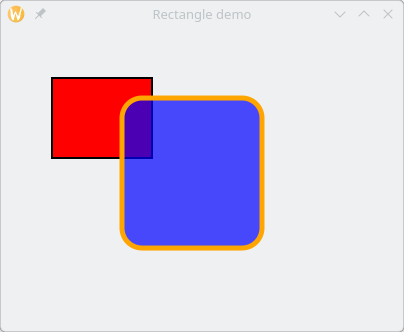
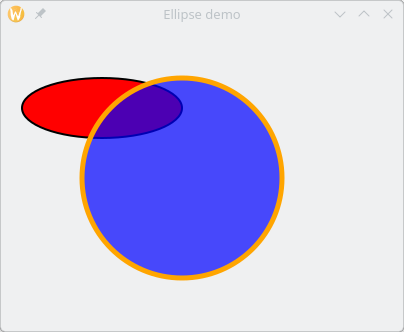
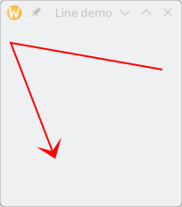
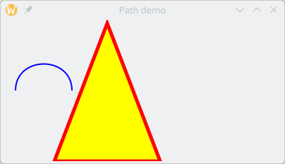

//  SPDX-License-Identifier: GFDL-1.3-or-later
//
//  Copyright © 2000-2024 Erick Gallesio <eg@stklos.net>
//
//           Author: Erick Gallesio [eg@stklos.net]
//    Creation date:  31-Oct-2024 09:48

== Canvases

GTKlos permits to access to the GTK canvas widget if the library
`GooCanvas 3` is installed {{stklos}} is configured.  `GooCanvas` is a
canvas widget for GTK+ that uses the Cairo 2D library for drawing. It
has a model/view split, and uses interfaces for canvas items and
views.

// ----------------------------------------------------------------------

{{class-doc "canvas"}}
=== Class <canvas>

{{show-class-table <canvas>}}

Slots::

- *automatic-bounds* indicates if the bounds are automatically calculated
   based on the bounds of all the items in the canvas.
- *background-color* is a strings that contains the color to use for the
   canvas background.
- *bounds-from-origin* indicates if the automatic bounds are calculated from
   the origin.
- *bounds-padding* is a float. It indicates the padding added to the automatic
   bounds.
- *canvas-x1* is the x coordinate of the left edge of the canvas bounds, in
   canvas units.
- *canvas-x2* is the x coordinate of the right edge of the canvas bounds, in
   canvas units.
- *canvas-y1* is the y coordinate of the top edge of the canvas bounds, in
   canvas units.
- *canvas-y2* is the y coordinate of the bottom edge of the canvas bounds, in
   canvas units.
- *clear-background* indicates if the background is cleared before the canvas
   is painted.
- *integer-layout* indicates if all item layout is done to the nearest integer.
- *resolution-x* is the horizontal resolution of the display, in dots per inch
- *resolution-y* is the vertical resolution of the display, in dots per inch
- *scale* is the magnification factor of the canvas.
- *scale-x* is the horizontal magnification factor of the canvas.
- *scale-y* is the vertical magnification factor of the canvas.

Methods::
- *initialize-instance* initializes the given canvas.
- *realize-widget* {{see-realize}}.

=== Canvas Items

Canvas items (rectangles, ellipses, ...)  are the components that are
displayed in a canvas widget. To add a canvas item in a given canvas, you just
need to set the parent of the canvas item to this canvas.

// ______________________________________________________________________
{{class-doc "canvas-rectangle"}}
==== Class <canvas-rectangle>

A `<canvas-rectangle>` represents a rectangle item. Since it is a subclass
_<gtk-canvas-item>_, it inherits all of the style properties such as `x`, `y`,
`fill-color` or `line-width`.

{{show-class-table <canvas-rectangle>}}

Slots::

- *radius-x* is the horizontal radius to use for rounded corners.
- *radius-y* is the vertical radius to use for rounded corners

Method::

- make-canvas-item {{see-make-canvas-item}}

Example::

[source,scheme]
----
(define w (make <vwindow> :title "Rectangle demo"))
(define c (make <canvas> :parent w :width 400 :height 300))

(define r1 (make <canvas-rectangle> :parent c
                 :x 50 :y 50 :width 100 :height 80 :fill-color "red"))

(define r2 (make <canvas-rectangle> :parent c
                 :x 120 :y 70 :width 140 :height 150
                 :stroke-color "orange" :radius-x 20 :radius-y 20
                 :line-width 5
                 :fill-color "rgba(0,0,255,0.7)"))
----

Here, we define two rectangles, a red one `r1` and a (partially transparent)
blue one `r2`. We obtain:

NOTE: Canvas items receive event signals as standard GTK widgets. For instance
we can define a behavior when entering in `r1` or when cliking `r2`

[source,scheme]
----
(event-connect r1 "enter-notify-event"   (lambda ignore (eprintf "Entering r1\n")))
(event-connect r2 "button-release-event" (lambda ignore (eprintf "Clicked r2\n")))
----

// ______________________________________________________________________
{{class-doc "canvas-ellipse"}}
==== Class <canvas-ellipse>

A `<canvas-ellipse>` represents an ellipse item.

{{show-class-table <canvas-ellipse>}}

Slots::

- *center-x* is the x coordinate of the center of the ellipse
- *center-y* is the y coordinate of the center of the ellipse
- *radius-x* is the horizontal radius of the ellipse
- *radius-y* is the vertical radius of the ellipse

Method::

- *make-canvas-item* {{see-make-canvas-item}}.

[source,scheme]
----
(define w (make <vwindow> :title "Ellipse demo"))
(define c (make <canvas> :parent w :width 400 :height 300))
(define e1 (make <canvas-ellipse> :parent c
                 :center-x 100 :center-y 80 :radius-x 80 :radius-y 30
                 :fill-color "red"))
(define e2 (make <canvas-ellipse> :parent c
                 :center-x 180 :center-y 150 :radius-x 100 :radius-y 100
                 :line-width 5 :stroke-color "orange"
                 :fill-color "rgba(0,0,255,0.7)"))
----

// ______________________________________________________________________
{{class-doc "canvas-line"}}
==== Class <canvas-line>

A `<canvas-line>` represents a line item. More exactly,it is a poly-line item
which is a series of one or more lines, with optional arrows at either end.

{{show-class-table <canvas-line>}}

Slots::

- *arrow-length* is a float which represents the length of the arrows, as a
   multiple of the line width.
- *arrow-tip-length* is a float which represents the length of the arrow tip,
   as a multiple of the line width.
- *arrow-width* is a float which represents the width of the arrows, as a
   multiple of the line width.
- *close-path* indicates if the last point should be connected to the first.
- *end-arrow* indicates if an arrow should be displayed at the end of the poly-line
- *points* is the list of points of the poly-line.
- *start-arrow* indicates if an arrow should be displayed at the start of the
   poly-line.

Method::

- *make-canvas-item* {{see-make-canvas-item}}.

Example::

[source,scheme]
----
(define w (make <vwindow> :title "Line demo"))
(define c (make <canvas> :parent w :width 100 :height 200))

(define l1 (make <canvas-line> :parent c :points '(180 50 10 20 60 150)
                 :stroke-color "red" :end-arrow #t
                 :arrow-length 10 :arrow-tip-length 5 :arrow-width 15))
----

// ______________________________________________________________________
{{class-doc "canvas-text"}}
==== Class <canvas-text>

A `<canvas-text>` represents a text canvas item.

{{show-class-table <canvas-text>}}

Slots::

- *alignment* indicates how to align the text. Its value can be one of the
   symbols `left`, `center` or `right`.
- *anchor* indicates how to position the text relative to the given `x` and
   `y` coordinates . Its value can be one of the symbols `center`, `north`,
   `north-west`, `north-east`, `south`, `south-west`, `south-east`, `west` or
   `east`.
- *ellipsize* indicates the preferred place to ellipsize the string, if the
   label does not have enough room to display the entire string. It's value
   can be one of the symbols `none`, `start`, `middle` or `end`.
- *use-markup* indicates whether we use _PangoMarkup_ in the text, to support
   different styles.
- *value* contains the text to display.
- *wrap* indicates the preferred method of wrapping the string if a width has
   been set. Its value can be one of the symbols `word`, `char` or `word-char`.
`
Method`::

- *make-canvas-item* {{see-make-canvas-item}}.

// ______________________________________________________________________
{{class-doc "canvas-image"}}
==== Class <canvas-image>

A `<canvas-image>` permits to add an image as a canvas item in a canvas.

{{show-class-table <canvas-image>}}

Slots::

- *alpha* is the opacity of the image (0.0 is fully transparent, and 1.0 is
   opaque).
- *image* contains the GTKlos image to display (see <<image_class>>)
- *pixbuf* contains the pixbuf to display (see <<image_class>>)
- *scale-to-fit* indicate if the image is scaled to fit the width and height
   settings.

Method::

- *make-canvas-item* {{see-make-canvas-item}}.

// ______________________________________________________________________
{{class-doc "canvas-path"}}
==== Class <canvas-path>

A `<canvas-path>` represents a path item, which is a series of one or more
lines, bezier curves, or elliptical arcs, using SVG specification. 

{{show-class-table <canvas-path>}}

Slot::

- *value* is the sequence of path commands as a string.

Method::

- *make-canvas-item* {{see-make-canvas-item}}.

Example::

[source,scheme]
----
(define w (make <vwindow> :title "Path demo"))
(define c (make <canvas> :parent w :width 400 :height 200))

(define p1 (make <canvas-path> :parent c :stroke-color "blue"
                 :value "M20,100 C20,50 100,50 100,100"))

(define p2 (make <canvas-path> :parent c :fill-color "yellow"
                 :stroke-color "red" :line-width 5
                 :value "M150 5 L75 200 L225 200 Z"))
----

