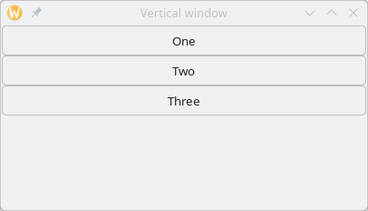
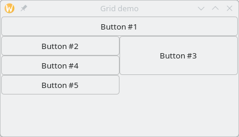
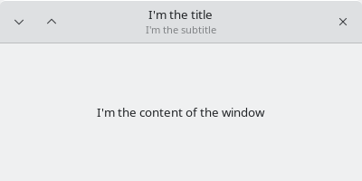

//  SPDX-License-Identifier: GFDL-1.3-or-later
//
//  Copyright © 2000-2024 Erick Gallesio <eg@stklos.net>
//
//           Author: Erick Gallesio [eg@stklos.net]
//    Creation date:  31-Oct-2024 09:48

== Container widgets

A container is a widget that can contain other widgets. It permits to
create new windows or organize le layout of a multi widget GUI
component.

{{class-doc "window"}}
=== Class <window>

The `<window>` class defines a new window. By default, a new window is
mapped on the screen when it is created and it's size is 200x200.

{{show-class-table <window>}}

Slots::

- *height* is the height of the window. The default is 200 pixels.
- *modal* is a boolean. It indicates if the window is in modal mode. A modal
   window prevents interaction with other windows in the same application.
- *resizable* indicates if the window size can be changed.
- *title* indicates the string to display in the window title bar.
- *transient* is a boolean. It indicates if the window is transient.
- *width* is the width of the window. The default is 200 pixels.

Method::

- *realize-widget* {{see-realize}}.

All these slots have an associated accessor that can be used to read or
write the value of the slot. For instance

<<<
[source,scheme]
----
stklos> (define w (make <window> :title "A window"))
;; w
stklos> (title w)
"A window"
stklos> (set! (title w) "Title changed")
stklos> (title w)
"Title changed"
stklos>
----

{{class-doc "vwindow"}}
=== Class <vwindow>

A `<vwindow>` is a utility class. It is a window which contains a vertical box,
to arrange vertically some widgets in it. See example below.

{{show-class-table <vwindow>}}

// Note:: The classes `<%vbox>` and `<%box>` are special classes used to
// initialize a new `<vwindow>` object. They are not exported by the GTKlos
// library and are not meant to be used in a user program.

Example::

[source,scheme]
----
stklos> (define w (make <vwindow> :title "Vertical window" :width 400))
;; w
stklos> (dolist (b '("One" "Two" "Three")) (make <button> :text b :parent w))
stklos>
----

This will display the following window:

Note:: Specifying that a button has `w` as parent permits to embed it in the `w` container.

{{class-doc "hwindow"}}
=== Class <hwindow>

A `<hwindow>` is a utility class. It is a window which contains an horizontal box,
to arrange horizontally some widgets in it.

{{show-class-table <hwindow>}}

// Note:: The classes `<%hbox>` and `<%box>` are special classes used to
// initialize a new `<vwindow>` object. They are not exported by the GTKlos
// library and are not meant to be used in a user program.

{{class-doc "gtk-box"}}
=== Class <gtk-box>

A `<gtk-box>` is a simple container which arranges child widgets into a single row or column, depending upon the value of `orientation` property.

WARNING: Normally, a class name prefixed by `<gtk-` is an internal class which is not exported bt the GTKlos library. This class name has been choose, because the name `<box>` is already used for the normal {{stklos}} boxes (see SRFI-111).

{{show-class-table <gtk-box>}}

Slots::
- *baseline-position* indicates the baseline position (see GTK documentation for more information)
- *expand* is a boolean which indicates if children must be expanded by default
- *fill* is a boolean which indicates if children fill the empty space by default.
- *homogeneous* is a boolean. It indicates if all children of the box are
   given equal space in the box.
- *padding* is teh default value of the padding
- *spacing*  is the number of pixels between children of the box (default is 0).

Methods::

- *container-add!* accepts a list of keyword parameters after the widget to
  add to the container. The possible values for these keyword parameters are:
** `expand` (defaults to the value of slot `expand` slot of the box)
** `fill` (defaults to the value of slot `fill` slot of the box)
** `padding` (defaults to the value of slot `padding` slot of the box)
** `end` add element to the end (default to `#f`)
- *realize-widget* {{see-realize}}

Notes::

One of the most important slot of this class is the slot `orientation`
(not shown here, since it is inherited from the class `<gtk-orientable>`). Its
value is a symbol which can be one of the symbols `horizontal` or `vertical`.

// ----------------------------------------------------------------------
{{class-doc "hbox"}}
=== Class <hbox>

This utility class can be used to define a `<gtk-box>` whose orientation is
initialized to `horizontal`.

{{show-class-table <hbox>}}

Method::
* *initialize-instance* {{see-initialize}}

// ----------------------------------------------------------------------
{{class-doc "vbox"}}
=== Class <vbox>

This utility class can be used to define a `<gtk-box>` whose orientation is
initialized to `vertical`.

{{show-class-table <vbox>}}

Method::
* *initialize-instance* {{see-initialize}}

// ----------------------------------------------------------------------
{{class-doc "frame"}}
=== Class <frame>

A `<frame>` widget surrounds its child with a decorative frame and an optional label.

{{show-class-table <frame>}}

Slots::

- *shadow*  can be one of the following symbols `none`, `in`, `out`, `etched-in` or `etched-out`.
- *title* contains the label of the frame
- *xalign* is a float to adjust the position of the title (0: left, 1: right, 0.5:default)
- *yalign* is a float to adjust the position of the title (0: top, 1: bottom, 0.5:default)

// ----------------------------------------------------------------------
{{class-doc "hframe"}}
=== Class <hframe>

This utility class permits to define a frame which contain an horizontal box
that can be filled with components that are arranged horizontally.

{{show-class-table <hframe>}}

{{class-doc "vframe"}}
=== Class <vframe>
This utility class permits to define a frame which contain an vframe box
that can be filled with components that are arranged vertically.

{{show-class-table <vframe>}}

// ----------------------------------------------------------------------
{{class-doc "grid"}}
=== Class <grid>

A `<grid>` widget is a container which arranges its child widgets in rows and columns, with arbitrary positions and horizontal/vertical spans.

{{show-class-table <grid>}}

Slots::

- *column-homogeneous* is a boolean which indicates whether all columns of the
   grid will have the same width.
- *column-spacing* is the amount of space between columns of the grid.
- *row-homogeneous* is a boolean which indicates whether all rows of the grid
   will have the same width.
- *row-spacing* is the amount of space between rows of the grid.

Methods::

* *container-add!* accepts a list of keyword parameters after the widget to
add to the container. The possible value for these keyword parameters are:
** `left` is the column position of the added widget (starting from 1)
** `top` is the line position of the added widget (starting from 1)
** `width` is the width position of the added widget
** `height` is the height position of the added widget
* *realize-widget* {{see-realize}}

Example::

[source,scheme]
----
stklos> (define w (make <window> :title "Grid demo"))
;; w
stklos> (define g (make <grid> :parent w))
;; g
;; Create 5 buttons
stklos> (define b (map (lambda (x) (make <button> :text x :width 200))
               '("Button #1" "Button #2" "Button #3" "Button #4" "Button #5")))
;; b
;; Add them to the grid
stklos> (container-add! g (list-ref b 0) #:left 0 #:top 0 :width 2)
stklos> (container-add! g (list-ref b 1) #:left 0 #:top 1)
stklos> (container-add! g (list-ref b 2) #:left 1 #:top 1 :height 2)
stklos> (container-add! g (list-ref b 3) #:left 0 #:top 2)
stklos> (container-add! g (list-ref b 4) #:left 0 #:top 3)
----

This will display the following window:

{{class-doc "header-bar"}}
=== Class <header-bar>

A `<header-bar>` is similar to a horizontal `<gtk-box>`. Furthermore, this widget
can add typical window frame controls, such as minimize, maximize and close
buttons, or the window icon. It is often used at the top of a `<vwindow>`

{{show-class-table <header-bar>}}

Slots::
- *decoration-layout* is a string used to indicate the layout of the buttons
   (see example below)
- *decoration-layout-set* is a boolean used to know if the decoration layout
   has been set
-  *has-subtitle* reserves space for a subtitle (even if not currently set).
- *show-close-button* indicates if the decoration buttons (not only the close
   button!!) are shown or not. Its default value is `#f`
- *subtitle* indicates the subtitle of the header bar (note that place is
   always reserved for a subtitle, except is `has-subtitle` is set to `#f`.
- *title* indicates the title of the header bar.

Method::
* *realize-widget* {{see-realize}}

Exemple::
The following example illustrates the use of a header bar.

[source,scheme]
----
(define w (make <vwindow> :width 400))

(define h (make <header-bar> :title "I'm the title"
                             :subtitle "I'm the subtitle"
                             :parent w
                             :decoration-layout "minimize,maximize:close"
                             :show-close-button #t))

(define l (make <label> :text "I'm the content of the window"
                        :parent (list w :expand #t)))
----

Execution of this code will display the following window

Notes::

1. The `decoration-layout` slot is set here to `"minimize, maximize:close"` to place

   - the _minimize_ and _maximize_ buttons on the left (since they are before
     the `':'` character)
    - the _close_ button on the right (since it is after the `':'` character)
2. The `show-close-button` is set to `#t` so display the control buttons
3. The `parent` is set here to `w` with an indication that it must be expanded
into it container (`w` here). See the documentation of `parent` of the
<<class-gtk-widget, `<gtk-widget>` class>>.

<<<
// ----------------------------------------------------------------------
{{class-doc "toolbar"}}
=== Class <toolbar>

A `<toolbar>` is container whose constituents are instance of the
`<toolbar-item>` class.

{{show-class-table <toolbar>}}

Slots::

- *expand* is a boolean. It indicates if toolbar items are expanded or not
   (default to `#f`)
- *icon-size* can be one of the following symbols `small`, `medium`, `large`
   or `huge`.
- *show-arrow* is the boolean. It indicates if the toolbar as an overflow menu.
- *toolbar-style*: can be one of the following symbols `icons`, `text`,
   `both` or `both-horizontal`.

Methods::

- *add-items-to-toolbar* is a utility method to easily populate the
components of a toolbar. It takes a toolbar and a list describing its
components with the following convention, for each item of the list:

1. an empty list specify to add a new separator, that is an instance of
`<toolbar-separator-item>`, to the toolbar
2. a list specifies that a new `<toolbar-icon-item>` must be created and added
to the toolbar. The content of the list are the parameters that must be passed
during the creation of the icon.

- *container-add!*: {{see-container-add}}.

<<<
Exemple:: 
[source,scheme]
----
(define w (make <vwindow> :title "Test header" :width 300))
(define tb (make <toolbar> :parent w))

(add-items-to-toolbar tb                            ;; populate the toolbar
 '((:text "Play"  :icon-name "media-playback-start")
   (:text "Pause" :icon-name "media-playback-pause")
   ()  ;; <== A separator
   (:text "Stop" :icon-name "media-playback-stop")))
----

Execution of this code will display the following window

image::images/toolbar-figure.png[images/toolbar-figure,align="center"]

Notes::

1. For the sake of simplicity, the buttons are inactive here (use the
`command` slot to add an action when the toolbar button is clicked).

2. Icons her are stock buttons they are searched by the GTK library in the
standard directory (generally `/usr/share/icons` on GNU/Linux).

3. Since `<gtk-toolbar>` inherits from `<gtk-orientable>`, a toobar can be
horizontal or vertical.

// ----------------------------------------------------------------------
{{class-doc "toolbar-item"}}
==== Class <toolbar-item>

The `<toolbar-item>` class is the parent class of the toolbar items classes
that can be added to a to a GTK toolbar. It offers only two methods
(*container-add*) to add an item to a toolbar.

{{show-class-table <toolbar-item>}}

Methods:: 

There are two methods of the generic function *container-add!* to add an item
to a container:

 - with 2 parameters, the methods permit to append the new item at the end of
    already added items.
 - with 3 parameters, the method adds the given item at the position given as
   third parameter (an integer). If the position is 0 the item is prepended to
   the start of the toolbar. If it is negative, the item is appended to the
   end of the toolbar.

// ----------------------------------------------------------------------
{{class-doc "toolbar-separator-item"}}
==== Class <toolbar-separator-item>

The class `<toolbar-separator-item>`  permits to define a separator to a toolbar.

{{show-class-table <toolbar-separator-item>}}

Methods::

- *realize-widget* {{see-realize}}.

// ----------------------------------------------------------------------
{{class-doc "toolbar-button-item"}}
==== Class <toolbar-button-item>

The class `<toolbar-separator-item>` permits to define a button to a
toolbar. The button can have an image and a text.

{{show-class-table <toolbar-button-item>}}

Slots::

- *command* is identical to the command associated to a button ({{see-command}})

- *icon-name* is a string which contains is the name of the themed icon
   displayed on the item.  Icons are searched by the GTK library in the
   standard directory (generally `/usr/share/icons` on GNU/Linux).

- *text* is the text of the button item.

Method::

- *realize-widget: {{see-realize}}
