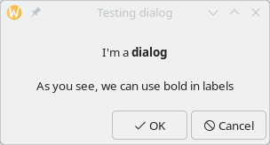
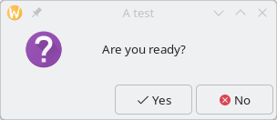
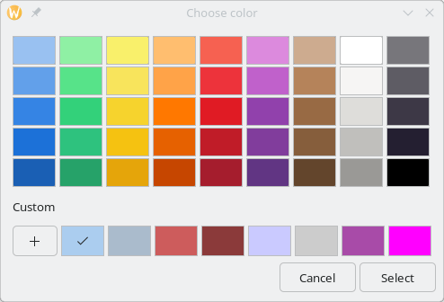
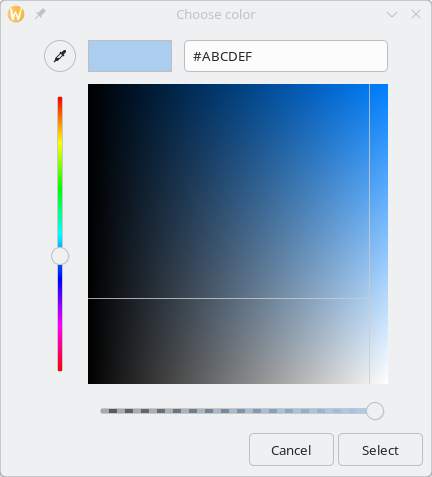

//  SPDX-License-Identifier: GFDL-1.3-or-later
//
//  Copyright © 2000-2024 Erick Gallesio <eg@stklos.net>
//
//           Author: Erick Gallesio [eg@stklos.net]
//    Creation date:  31-Oct-2024 09:48

== Dialog box widgets

A dialog box is a graphical interface component consisting of a window displayed by a program  for:

- inform the user of an event, or
 - obtain user information.

{{class-doc "dialog"}}
=== Class <dialog>

A `<dialog>` is a a window split vertically. The top section is the
place where widgets such as a label or an entry should be packed. The
bottom area is generally used for packing buttons into the dialog
which may perform functions such as cancel, ok, or apply.

{{show-class-table <dialog>}}

Methods::

- *container-add!* permits to add a widget to the top area of the
   dialog window (above the buttons).

[#dialog-run]
- *dialog-run* is a function that must be run to wait the user response. When
   the user chooses a button, the string associated to this button is returned
   as result. If the user clicks the close button, the value returned is `#f`.

[#dialog-realize]
- *realize-widget* permits to specify at creation time the buttons used by the
   dialog with the `:buttons` valued parameter. the default buttons are a "OK
   and " and "Cancel" buttons.  The specified value can be the name of a GTK
   stock item and an icon will be associated to the text.  For instance
   "gtk-ok" will add a button with text "Ok" and a check. So the default value
   for the `:buttons` parameter is the list `("gtk-ok" "gtk-cancel")`. See
   official GTK documentation for the possible names for GTK stock
   items. *Note that the usage of GTK stock items is now deprecated*. You can
   also {{see-realize}}.

<<<

Exemple::

[source,scheme]
----
(let ((d (make <dialog> :width 300 :title "Testing dialog")))
  ;; Add two labels to this dialog
  (container-add! d (make <label>
                      :text "\nI'm a <b>dialog</b>"))
  (container-add! d (make <label>
                      :text "\nAs you see, we can use bold in labels\n"))

  (let ((res (dialog-run d)))
    (if res
        (eprintf "You clicked the button ~s\n" res)
        (eprintf "Dialog box was closed by the user\n"))
    (destroy d)))
----

Executing the previous code will create the following window:

The make-simple-message-dialog procedure::

The `make-simple-message-dialog` permits to easily build dialog window. It
takes three mandatory parameters.

1. the title of the dialog window
2. the type of the dialog. It is a symbol and can be `error`, `info`
`password`, `question`, `warning`.
3. the message that must be displayed in above the buttons

The following parameters are also accepted:

- *buttons* is a list of buttons (by default, this list contain a OK and
   Cancel buttons).
- *width* the width of the dialog window (default 300)
- *height* the height of the dialog window (default 100)

This procedure also runs the dialog, and waits for the user response. The result is
the name of the clicked button (or ``#f` is destroyed). See below:

[source, scheme]
----
(make-simple-message-dialog "A test" 'question "Are you ready?"
                             :buttons '("gtk-yes" "gtk-no"))

----

Executing the previous code will create the following window, and wait until
the user responds. When execution continues, the result will be `"gtk-yes"`,
`"gtk-no"` of `#f`

// ----------------------------------------------------------------------
{{class-doc "color-dialog"}}
=== Class <color-dialog>

A `<color-dialog>` is a specialized dialog box for choosing a color.

{{show-class-table <color-dialog>}}

Slots::

- *show-editor* indicates if the dialog will use a standard palette or if we
   want to see a color editor (default is `#f`).
- *value* is a starting value used when the dialog is initialized.

Methods::

- *dialog-run* run the color dialog ({{see-dialog-run}}). When it terminates it
   will return  the color as a string., or `#f` if cancelled
- *realize-widget* see {{see-dialog-realize}}

Example::

[source,scheme]
----
(dialog-run (make <color-dialog> :title "Choose color"
                  :show-editor #f :value "#abcdef"))
----

If `show-editor` is set to `#t` we'll have

//----------------------------------------------------------------------

{{class-doc "file-dialog"}}
=== Class <file-dialog>

A `<color-dialog>` is a specialized dialog box for choosing one or several files.

{{show-class-table <file-dialog>}}

Slots::

- *dialog-type* indicates the reason of file selection. It can be the symbols
  `open`, `save`, `open-folder`, `create-folder`. The buttons displayed at the
  bottom of the dialog depends of the dialog type. The default value for this
  slot is `open`.
- *select-multiple* indicates if multiple selection ar possible
- *show-hidden* indicates if hidden files are shown.
- *value* is the initial chosen file or directory.

Methods::

- *dialog-run* permits to run the file dialog ({{see-dialog-run}}).
- *realize-widget* see {{see-dialog-realize}}.

//----------------------------------------------------------------------
{{class-doc "font-dialog"}}

=== Class <font-dialog>

A `<font-dialog>` is a specialized dialog box for choosing a font.

{{show-class-table <font-dialog>}}

Slots::
- *preview-text* is the text to show in the preview window (by default it is
   the classical "The quick brown fox jumps over the lazy dog.")
- *show-preview-entry* indicates if the preview entry is displayed or not.
- *value* is the font used for the preview

Methods::

- *dialog-run* permits to run the font dialog ({{see-dialog-run}}). The value
   returned is the selected font as a string, or `#f` if cancelled.
- *realize-widget* {{see-realize}}.
